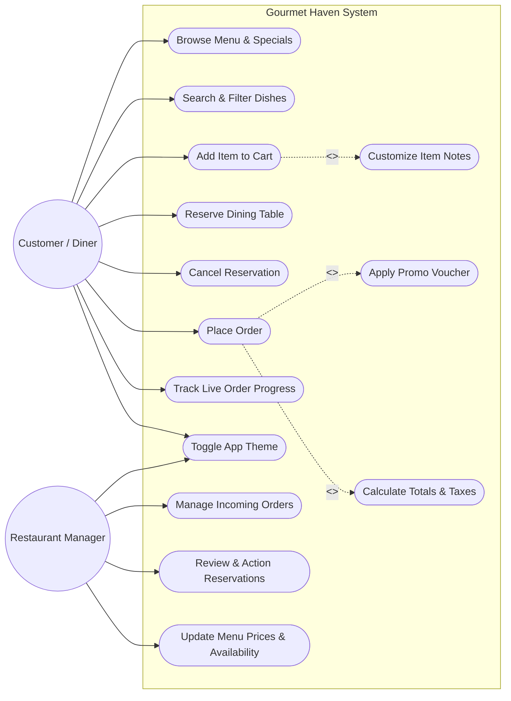
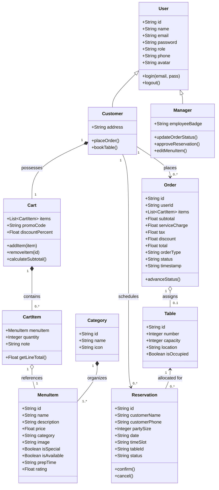
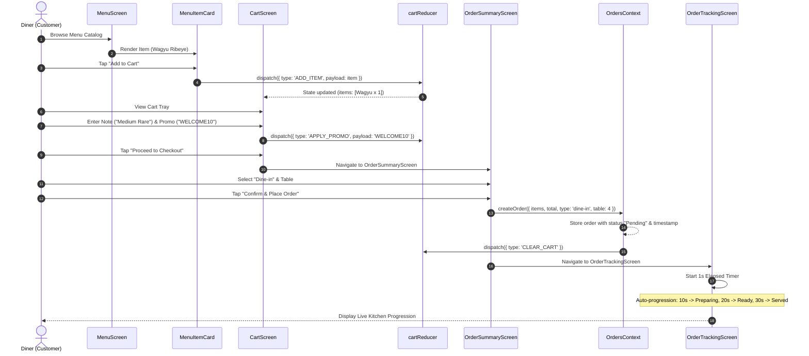
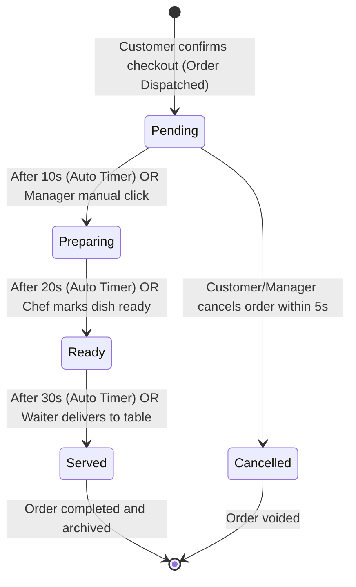

# Gourmet Haven — UML Architectural Diagrams (A1 Deliverables)

This folder contains the complete visual models for the **Gourmet Haven Restaurant App MVP**, fulfilling all specifications of **Question 2** in `A1-FA2026.docx`.

---

## 1. Summary of Diagrams

| Diagram # | Diagram Type | System Scope & Relationships | Status |
|---|---|---|---|
| **1** | **Use Case Diagram** | Customer & Restaurant Manager actors, 12+ use cases (`<<include>>`, `<<extend>>`) | Available below & in `view_diagrams.html` |
| **2** | **Class Diagram** | `User`, `Customer`, `Manager`, `Category`, `MenuItem`, `Cart`, `CartItem`, `Order`, `Reservation`, `Table` | Available below & in `view_diagrams.html` |
| **3** | **Sequence Diagram** | Chronological flow: "Customer places an order" (Add to Cart ➔ Order Tracking) | Available below & in `view_diagrams.html` |
| **4** | **State Machine Diagram** | Order lifecycle transitions (`Pending` ➔ `Preparing` ➔ `Ready` ➔ `Served` / `Cancelled`) | Available below & in `view_diagrams.html` |
| **5** | **Component Diagram** | React Native architecture: Screens, Context Providers, Reducers, Hooks | Available below & in `view_diagrams.html` |

*(An interactive HTML visualizer with 1-click SVG/PNG export is provided in [`view_diagrams.html`](view_diagrams.html)).*

---

## Diagram 1: Use Case Diagram

---

## Diagram 2: Class Diagram

---

## Diagram 3: Sequence Diagram (Customer Places an Order)

---

## Diagram 4: State Machine Diagram (Order Lifecycle)

---

## Diagram 5: Component & Context Architecture Diagram

```mermaid
graph TD
    subgraph UI_Screens ["Presentation Layer (Screens & Components)"]
        LoginScreen["LoginScreen (3D Flip / Form Validation)"]
        MenuScreen["MenuScreen (Debounced Search / Filter / Sort)"]
        MenuItemCard["MenuItemCard (React.memo Optimized)"]
        CartScreen["CartScreen (Quantity Stepper / Promo Input)"]
        OrderSummaryScreen["OrderSummaryScreen (Financial Totals)"]
        ReservationScreen["ReservationScreen (Table Slot Matrix)"]
        OrderTrackingScreen["OrderTrackingScreen (Live Timer & Stepper)"]
        ManagerDashboardScreen["ManagerDashboardScreen (Operations Console)"]
        ProfileScreen["ProfileScreen (Dark/Light Switch & Logout)"]
    end

    subgraph Context_Layer ["State & Business Logic Layer (Contexts & Reducers)"]
        ThemeProvider["ThemeProvider (useTheme)"]
        AuthProvider["AuthProvider (useAuth)"]
        MenuProvider["MenuProvider (useMenu)"]
        CartProvider["CartProvider + cartReducer (useCart)"]
        OrdersProvider["OrdersProvider (useOrders)"]
        useReservationHook["useReservation Custom Hook"]
        useDebounceHook["useDebounce Custom Hook"]
        useFormHook["useForm Custom Hook"]
    end

    subgraph Storage_Layer ["Persistence Layer"]
        safeStorage["safeStorage (AsyncStorage + Memory Fallback)"]
    end

    MenuScreen --> MenuItemCard
    MenuScreen --> useDebounceHook
    ReservationScreen --> useReservationHook
    LoginScreen --> useFormHook

    MenuScreen --> MenuProvider
    MenuScreen --> CartProvider
    CartScreen --> CartProvider
    OrderSummaryScreen --> CartProvider
    OrderSummaryScreen --> OrdersProvider
    OrderTrackingScreen --> OrdersProvider
    ManagerDashboardScreen --> OrdersProvider
    ManagerDashboardScreen --> MenuProvider
    ProfileScreen --> AuthProvider
    ProfileScreen --> ThemeProvider
    LoginScreen --> AuthProvider

    AuthProvider --> safeStorage
    ThemeProvider --> safeStorage
    OrdersProvider --> safeStorage
    MenuProvider --> safeStorage
    useReservationHook --> safeStorage
```

