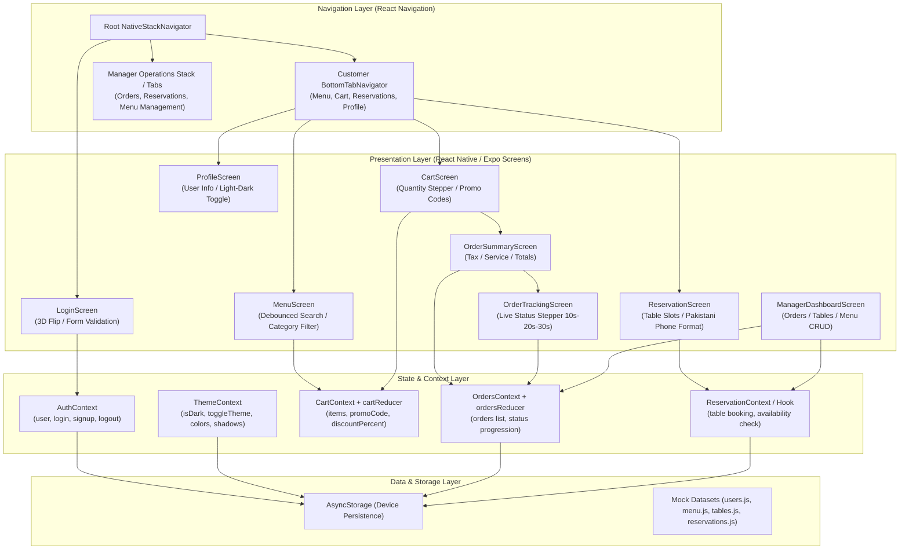
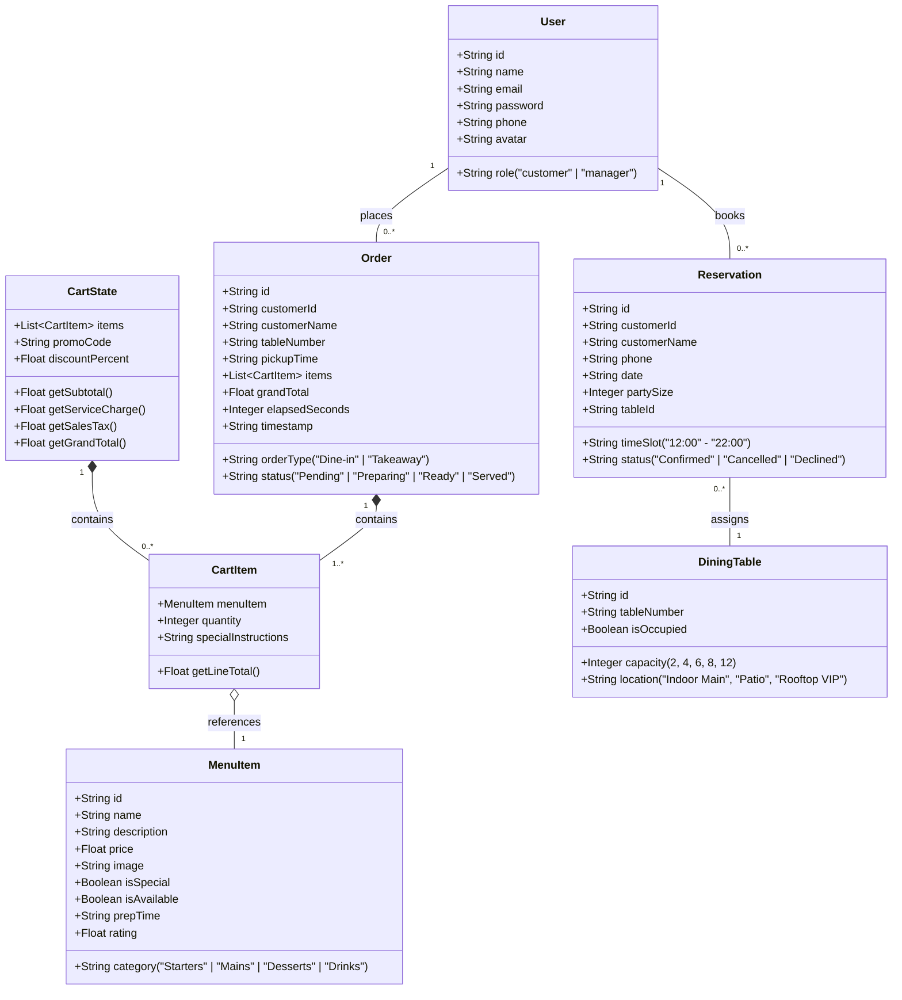
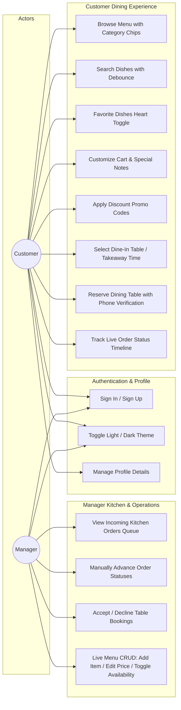
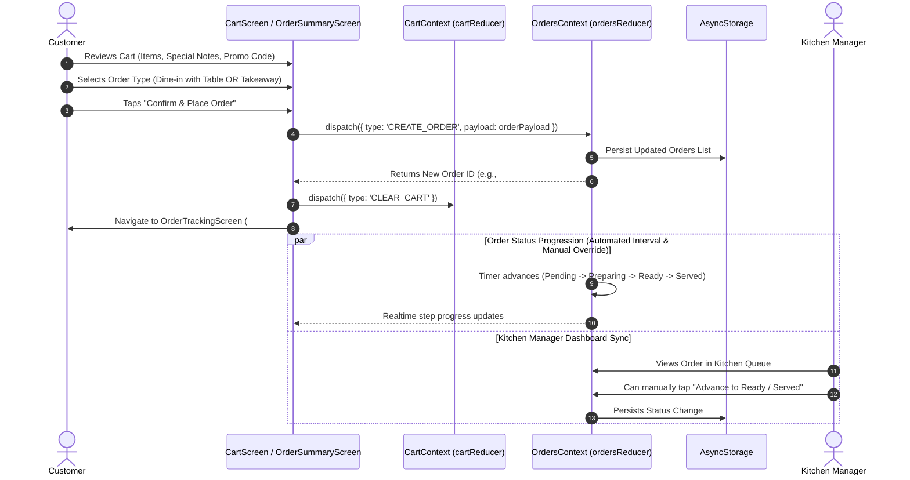
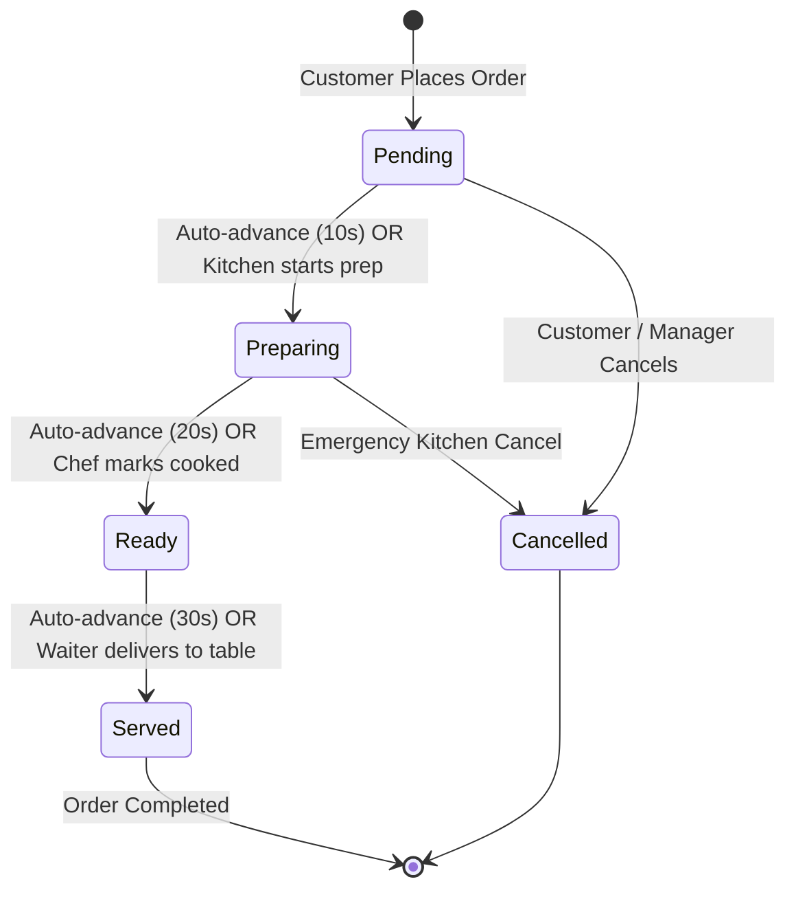

# Gourmet Haven — Complete UML Architecture & System Design

This document details the complete architectural design, data models, state workflows, and use case diagrams for the **Gourmet Haven Restaurant Application**.

---

## 1. High-Level System Architecture & Component Diagram

---

## 2. UML Class / Data Model Diagram

---

## 3. Use Case Diagram (Customer vs. Manager)

---

## 4. Sequence Diagram: Order Placement & Kitchen Fulfillment

---

## 5. State Transition Diagram: Order Lifecycle & Kitchen Pipeline

